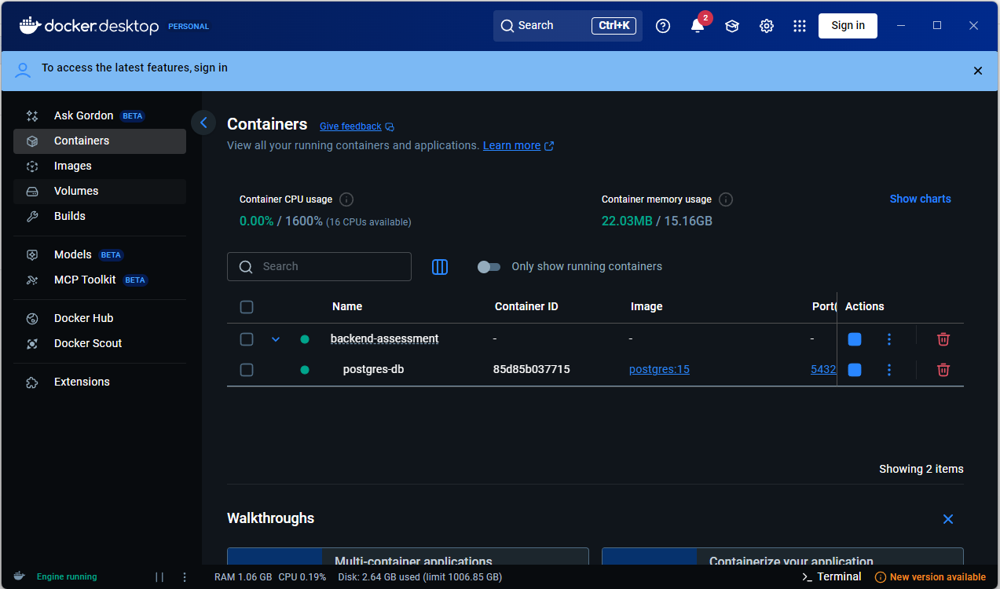
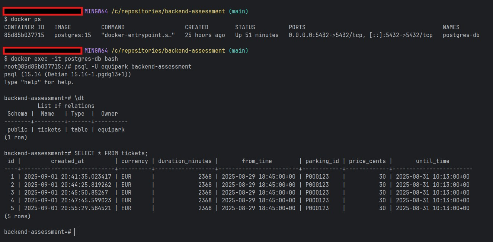
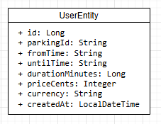

# Paymeter Backend Software Engineer Assessment

## Deliverable

There is quite some flexibility in what can be delivered, just ensure the service:

* is a web service
* can run on Mac OS X or Linux (x86-64)
* is written in Java
* uses Spring Boot
* can make use of any existing open source libraries that don't directly address the problem statement (use your best judgement)

Send us:

* The full source code, including any code written which is not part of the normal program run (scripts, tests)
* Clear instructions on how to obtain and run the program
* Please provide any deliverables and instructions using a public Github (or similar) Repository as several people will need to inspect the solution

## Evaluation
The point of the exercise is for us to see some of the code you wrote (and should be proud of).
We will especially consider:

* Code organisation
* Quality
* Readability
* Actually solving the problem

## Instructions

To run the application, run the following command in a terminal window:
```shell
# java 17 in host
./gradlew bootRun

# using docker
docker build -t app . && docker run -it -p 8080:8080 app
```

Check service is running:
```shell
curl http://localhost:8091
```

Execute the following command to test the application:
```shell
# java 17 in host
./gradlew test

# using docker
docker run --rm -u gradle -v "$PWD":/home/gradle/project -w /home/gradle/project gradle:8-jdk17 gradle test
```

## Challenge

Our customers want to be sure they're properly charging the correct amount on their parkings. 
For this reason, we plan to create a new pricing calculation feature so they can test multiple scenarios.
We have two customers with one parking each:

* Customer 1:
  * Parking id: `P000123`
  * Hourly price: 2€
  * Discounts
    * Max price per day: 15€

* Customer 2 
  * Parking id: `P000456`
  * Hourly price: 3€
  * Discounts
    * Max price every 12 hours: 20€
    * First hour is free

Note:
  * The price of a fraction of an hour is the same as a full hour
  * If duration of the stay is less than one minute, parking is free
  * There's no max time for a stay
  * There's no limit of times that max price discount can be applied
  * Max price discount starts counting when entering the parking 

Requirements:
* Endpoint: POST `/tickets/calculate`
* Request:
  * Content type: JSON
  * Fields:
    * `parkingId`: string (required)
    * `from`: ISO 8601 timestamp string (required)
    * `to`: ISO 8601 timestamp string (optional, defaults to current time)
* Response:
  * Content type: JSON
  * Fields:
    * `parkingId`: string (required)
    * `from`: ISO 8601 timestamp string (required)
    * `to`: ISO 8601 timestamp string (required)
    * `duration`: integer (minutes)
    * `price`: string (integer amount + currency code, e.g. 2.35€ would be `"235EUR"`)
  * Status codes:
    * 200 ok
    * 400 invalid request
    * 404 parking not found
    * 500 server error
    * (feel free to return any status codes needed)

Example usage:
```shell
curl --location 'http://localhost:8091/api/v1/tickets' \
--header 'Content-Type: application/json' \
--data '{
    "parkingId": "P000123",
    "from": "2025-08-30T20:45:00.123",
    "to": "2025-08-31T12:13:00.123"
}'
```

# Instructions

This project implements a system to calculate the cost of a car's time spent in a given parking lot. The calculation is based on business rules defined for each parking lot.

The microservice has a docker-compose.yml file which contains the configuration needed to launch a PostgreSQL DB image in a Docker container. Just run the **docker-compose up** command.



## Health

The project has implemented Spring Actuator to validate information and the health of the microservice, with the following URLs:

-http://localhost:8091/actuator/health

-http://localhost:8091/actuator/info

## Implementación

To run this project, run the main method of the main class.

## Unit tests

To run unit tests, right-click on the test suite and select "Run tests."

## Api Reference

#### Ticket Creation

```http
POST api/v1/tickets
```

| Parameter   | Type     | Description                                        |
|:------------|:---------|:---------------------------------------------------|
| `parkingId` | `string` | **Mandatory**. Parking Id                          |
| `from`      | `string` | **Mandatory**. Date of entry to the establishment  |
| `to`        | `string` | **Mandatory**. Departure date to the establishment |

### JSON Excample

```json
{
  "parkingId": "P000123",
  "from": "2025-08-31T20:45:00.123",
  "to": "2025-08-30T12:13:00.123"
}
```

### Ejemplo de Respuesta JSON

```json
{
  "parkingId": "P000123",
  "from": "2025-08-30T20:45:00.123",
  "until": "2025-08-31T12:13:00.123",
  "durationMinutes": 928,
  "price": "15 EUR"
}
```

## Technology Stack

**Client:** Swagger

**Server:** Java 17, Srping Boot 3.2.3, Gradle, JUnit 5

- To access Swagger, use: [http://localhost:8091/swagger-ui/index.html](http://localhost:8181/swagger-ui/index.html)
- To access the database hosted in the Docker container, use: 


The class diagram is in the resource package.

classDiagram

    class UserEntity {
        + id: Long
        + parkingId: String
        + fromTime: String
        + untilTime: String
        + durationMinutes: Long
        + priceCents: Integer
        + currency: String
        + createdAt: LocalDateTime
    }



## Autor

- Jorge Lopez.